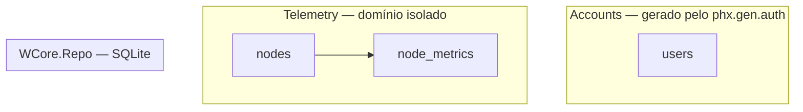

# Step 1 — Fundação e Autenticação

## O que foi implementado

- Projeto Phoenix criado sem mailer e sem dashboard
- SQLite configurado via `ecto_sqlite3` como adapter do Repo (em /tmp)
- Autenticação completa gerada via `phx.gen.auth` (usando pbkdf2)
- Contexto `Telemetry` criado com dois schemas: `Node` e `NodeMetric`
- Migrations executadas com sucesso

## Arquitetura atual

## Decisões e trade-offs

### Por que SQLite e não Postgres?
O sistema roda na borda (edge computing), dentro do servidor da planta.
Não há infraestrutura de banco gerenciado. SQLite embutido é a única
opção que não adiciona dependência externa.

### Por que separar `Node` de `NodeMetric`?
`Node` é um cadastro estático. `NodeMetric` é o estado vivo do sensor.
Separar os dois permite que o upsert do WriteWorker toque apenas `node_metrics`.
