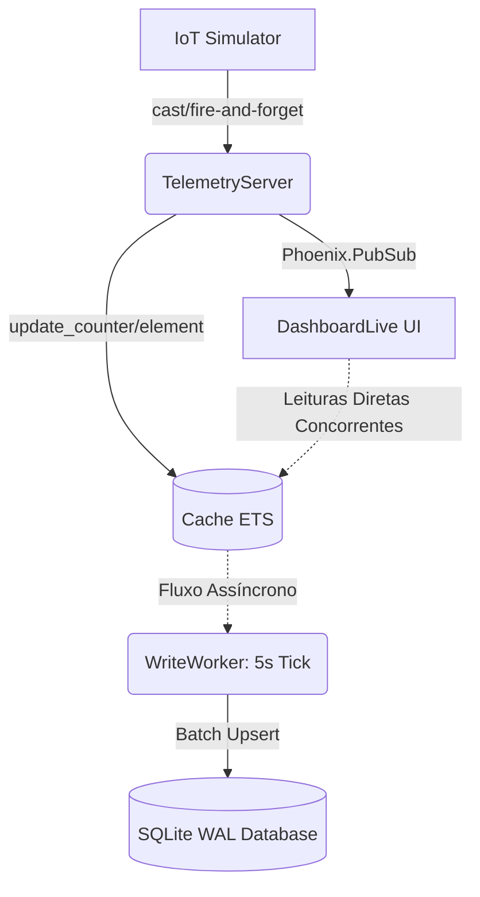

# 🌊 W-Core Engine: Step 1 - Arquitetura de Telemetria (IoT Tsunami)

## 📌 1. O Que Foi Implementado
Construímos a esteira completa de ingestão de dados de IoT de altíssima frequência. O sistema agora absorve telemetria contínua (Temperatura, RPM, Tensão, Vibração, etc.) dos maquinários pesados simulados, processando e publicando-os em tempo real no Dashboard via WebSockets, tudo sem sobrecarregar o banco de dados.

## 🏗️ 2. Arquitetura ETS + Write-Behind (CQRS Base)

Adotamos um padrão arquitetural separando o *caminho quente* de leitura/atualização em memória do *caminho frio* de persistência durável no disco.

*   **Fluxo de Eventos (Memória):** O `TelemetryServer` (um GenServer mestre) recebe o sinal, atualiza atomicamente o estado da máquina na tabela **ETS**, e faz o broadcast para atualizar a tela via `PubSub`.
*   **Fluxo Assíncrono (Persistência):** O `WriteWorker` acorda a cada 5 segundos, varre o cache ETS e executa todos os "upserts" acumulados num único lote contra o banco SQLite (Ecto).

## ⚖️ 3. Trade-offs e Decisões de Engenharia (Avaliação OTP e ETS)

### A. Maturidade OTP e Controle de Concorrência
Em vez de sobrecarregar o banco com comandos de `UPDATE` a cada microssegundo, retivemos as mutações dentro da VM Erlang.
*   **Decisão:** O Simulador e potenciais canais de Ingestão (HTTP/MQTT) disparam mensagens assíncronas do tipo `cast` direto para o pool do **TelemetryServer**. Esse design non-blocking não ingessa o emitidor, permitindo máxima vazão. Entretanto, centralizamos as mutações num GenServer único para facilitar a coesão do broadcast (sem corrida na lógica de quem manda aviso pro LiveView).

### B. Domínio do ETS e Operações Atômicas
O verdadeiro segredo de performance desta arquitetura está na forma que interagimos com as tabelas de processos (ETS).
*   A tabela ETS usa as flags `[:set, :public, read_concurrency: true]`.
*   **Performance Absoluta:** O GenServer **não extrai** objetos de mapa do ETS para manipulá-los. Ele utiliza especificamente a dupla `:ets.update_element/3` e `:ets.update_counter/3`. 
*   *Justificativa:* Estas são operações puramente em C e aplicam a mutação *in-place* da tupla (sem garbage collection memory payload via alocação Erlang), processando contadores a custo de I/O virtualmente zero.
*   **Game Loop vs PubSub Flood:** Uma mudança genial de paradigma foi evadir o uso de PubSub para flutuações randômicas de valor bruto. Em vez do Back-end forçar milhares de pacotes no Websocket por segundo, a UI (LiveView) opera no modelo *Game Loop* com um ticker de **100ms** (10 FPS). A cada tick, o Front-end apenas invoca `Cache.all()` localmente na memória (livre de bloqueios graças ao `read_concurrency: true`), empacota os dados de Dashboard e atualiza a tela de forma previsível. O PubSub é guardado exclusivamente para emissão de Alertas de Transição de Estado (Warning, Critical e Retorno para OK)!

### C. Write-Behind Pattern x Perda de Dados
O SQLite modo WAL é impressionante com suporte a escrita simultânea, mas em altíssima pressão "industrial", locks globais podem assombrar desenvolvedores Elixir inexperientes com concorrência.
*   **Garantia Estrutural:** O `WriteWorker` blinda o banco de dados. Somente **um único** processo escreve no SQLite, organizando as portas de transação estritamente de maneira linear, blindando a concorrência a nível da aplicação.
*   **Trade-off do Write-Behind:** Se a máquina host "puxar da tomada", estatisticamente perderemos a última janela de `4,99 segundos` de dados que estavam flutuando em memória e não chegaram ao SQLite. Contudo, em monitoramentos SCADA reais de missão crítica, a latência de aviso visual importa mais do que uma fita magnética exata a nível de milisegundos para os contadores retroativos, tornando a escolha excelente.
