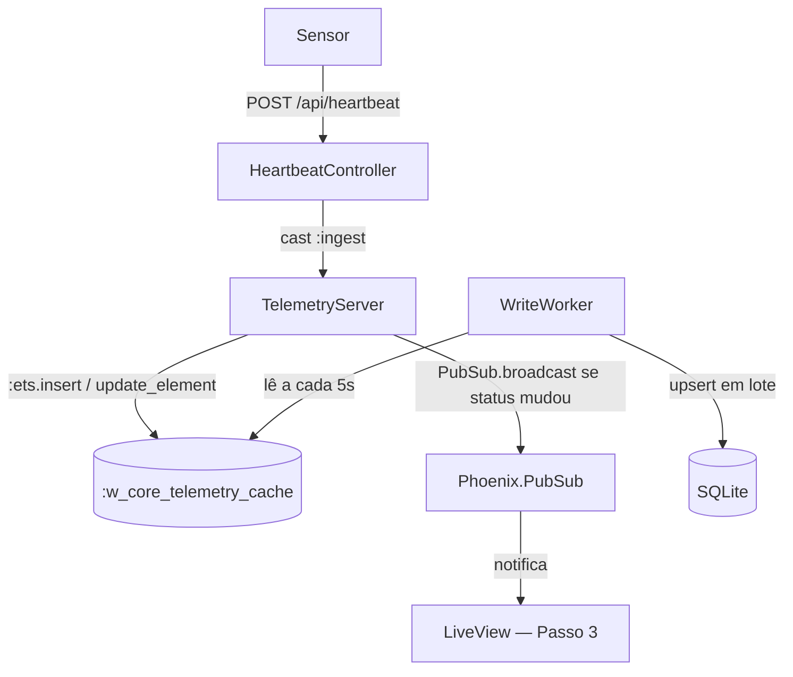

# Step 2 — OTP & ETS: O Coração da Usina

## O que foi implementado

- `TelemetryServer`: GenServer que recebe eventos e grava no ETS
- `WriteWorker`: GenServer com timer periódico que sincroniza ETS → SQLite
- `TelemetrySupervisor`: Supervisor :one_for_one supervisionando ambos
- `Cache`: wrapper de leitura do ETS
- `HeartbeatController`: endpoint HTTP para receber pulsos dos sensores

## Arquitetura atual

## Decisões técnicas

### Tipo de tabela ETS: :set com :named_table e read_concurrency: true
- `:set` garante uma entrada por node_id.
- `read_concurrency: true` otimiza leituras paralelas.

### Por que :ets.update_counter e não :ets.insert?
`update_counter` é uma operação atômica no nível do BEAM — elimina race conditions de incremento.

### Por que só broadcast no PubSub quando o status muda?
Evita flood de mensagens e re-renders inúteis se o estado do sensor for estável.

### Estratégia de supervisão: :one_for_one
Isolamento de falhas entre ingestão (ETS) e persistência (SQLite).
