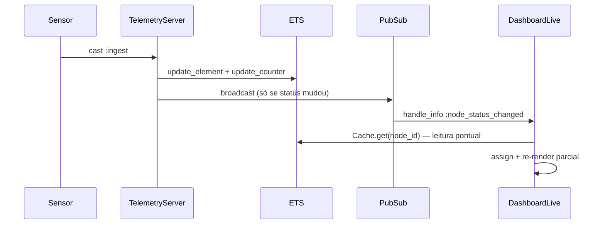

# Step 3 — LiveView & Design System

## O que foi implementado

- `PlantComponents`: design system HEEx com status_badge,
  machine_card e stat_card.
- `DashboardLive`: dashboard em tempo real protegido por autenticação.
- Flash visual para status critical com limpeza automática após 1500ms.
- Estatísticas agregadas reativas (total, ok, warning, critical).

## Arquitetura de leitura

