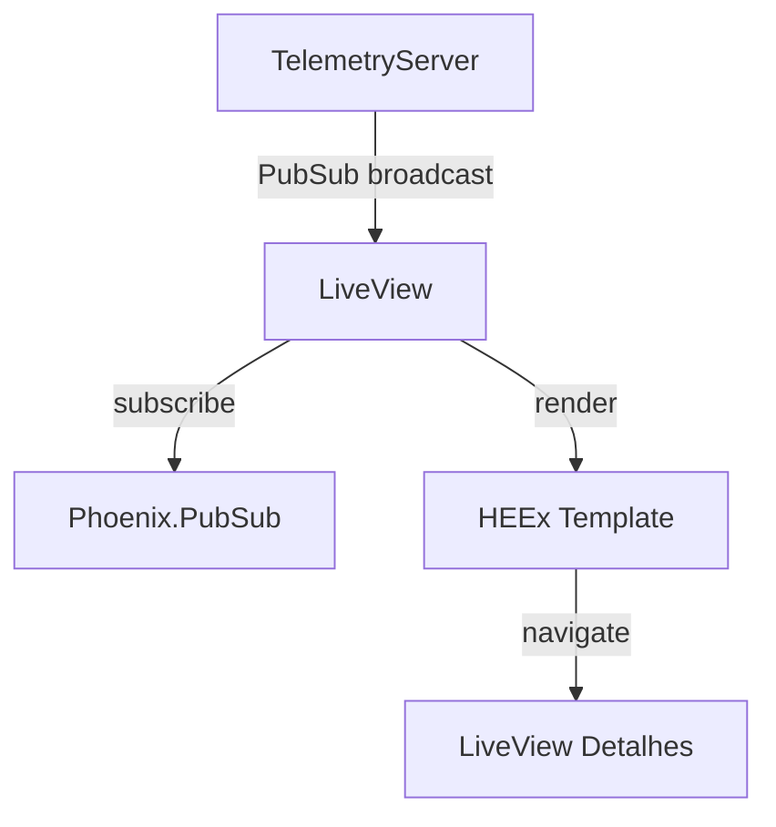

# Step 3 — A Janela de Controle (LiveView & Tempo Real)

## O que foi implementado

- `TelemetryLive.Index`: Visualização geral da planta com cards reativos.
- `TelemetryLive.Show`: Detalhes técnicos de um nó com formatação de JSON payload.
- Integração `Phoenix.PubSub`: Atualização automática da UI quando o `TelemetryServer` detecta mudança de status.
- Navegação fluida entre dashboard e detalhes.

## Arquitetura de UI

## Decisões Técnicas

### Atualização Reativa Seletiva
No `Index.ex`, o `handle_info` reconstrói apenas a lista de `nodes` no socket, mas o Phoenix LiveView (via morphdom) atualiza apenas o card específico que sofreu alteração no DOM. Isso garante performance mesmo com centenas de sensores.

### Estética Industrial
Utilizamos um esquema de cores semântico:
- **Verde**: Operação normal.
- **Âmbar**: Alerta/Atenção.
- **Vermelho**: Crítico (com animação de pulso/bounce).

### Unused Logic Prevention
O sistema apenas publica no PubSub se `prev_status != status`. Isso reduz drasticamente a carga nos processos LiveView conectados, evitando processamento de heartbeats redundantes que não alteram o estado visual.
